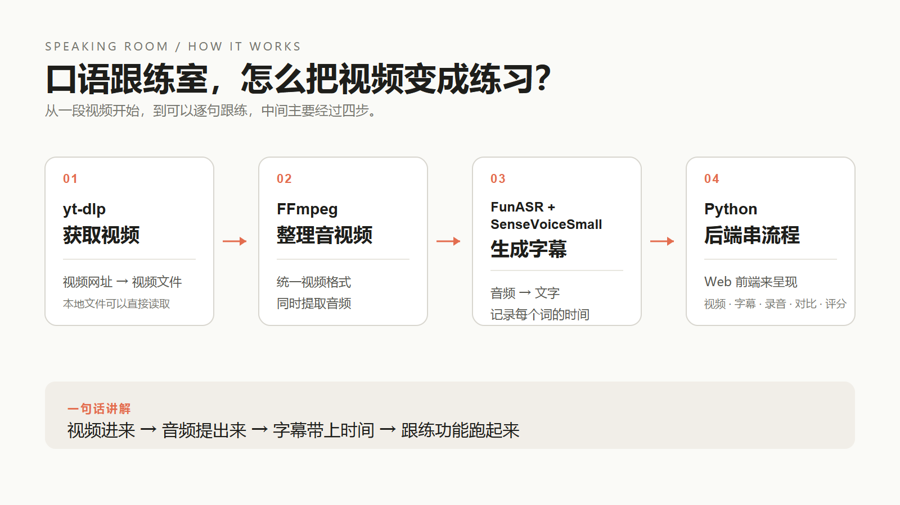

# 口语跟练室｜口播稿初稿

这版先按“钩子 → 功能 → 怎么扩展 → 怎么实现”的顺序写。录制时可以根据画面删减，保留自然停顿。

## 口播正文

你有没有这种感觉？

收藏了很多视频，看到别人讲话特别流畅，自己也想跟着练。可是真正轮到自己开口的时候，脑子里明明知道要说什么，嘴上就是跟不上。

英语跟读、口播练习、演讲彩排，大家都知道要多练。问题是，练完以后经常不知道自己哪里需要改，也很难坚持下去。

所以我做了一个工具，叫“口语跟练室”。以后所有和口语练习有关的东西，都可以放到这里面。

现在它已经可以做什么呢？

首先，你可以添加一段视频。可以是视频网址，也可以是自己电脑里的本地视频。工具会把视频整理好，然后把里面的内容识别成字幕，再切成一句一句的训练片段。

接下来，你可以选中其中一句，先听案例怎么说，再轮到自己录。录完以后，可以把案例和自己的声音放在一起对比，听听自己的语速、停顿和语气，差别到底在哪里。

如果打开摄像头，还可以把画面一起录下来。这样练口播的时候，表情、动作和镜头感也能一起看。

现在里面还有一个快速模仿分。它会根据语气变化、声音力度和说话时长，给出一个参考分数。这个分数更像一个练习时的提示，真正要不要调整，还是要结合 A 案例和 B 我的录音一起听。

我给它取名叫“口语跟练室”，就是想把范围留得更大一点。

你可以拿它练自己的口播稿，也可以拿它练英语跟读。以后换成日语、韩语，或者其他语言的材料，也可以放进来。要准备演讲、答辩，甚至是面试，提前把稿子分成一段一段，先彩排几遍，也可以放在这里面完成。

如果只是想换一批练习内容，其实很简单，添加视频就可以了。

如果想增加一种新的练习方式，大概只需要改三块：第一块是练什么素材，第二块是每一步怎么练，第三块是最后看什么结果。比如演讲彩排，就可以在现有的跟读流程上，加上整段计时、稿件提示和多次录音对比。

它的核心流程不会变：找到一段内容，拆成适合练习的小段，然后让你反复听、反复说、反复比较。

最后简单讲一下它是怎么实现的。

这张图可以把整个流程讲清楚。

第一步，用 `yt-dlp` 获取视频。如果是本地文件，就直接读取。

第二步，用 `FFmpeg` 把视频转换成统一格式，同时把里面的音频提取出来。

第三步，基于这段音频，用 `FunASR + SenseVoiceSmall` 把人声识别成字幕，并记录每个词对应的时间。这样系统就能知道每句话从哪里开始、到哪里结束，后面才能一段一段地播放和跟练。

最后，Python 作为后端，负责把视频获取、音频提取、字幕识别这些步骤串起来；Web 作为前端，负责把视频、字幕、录音、对比和评分呈现出来。

所以整个流程就是：先拿到视频，再提取音频，用模型生成带时间戳的字幕，最后由后端和前端把整个跟练功能跑起来。

所以它不只适合练英语，也不只适合练口播。只要是一段你想模仿、想演练、想反复练习的口语内容，都可以放进“口语跟练室”。后面我也会继续把它做成一个更完整的口语练习工具。

## 录制时可以强调的三句话

- 先听案例，再录自己，马上 A/B 对比。
- 口播、英语跟练、其他语言和演讲彩排，都可以往里面放。
- 当前评分是练习参考，核心还是让你听见差别，然后马上重练。

## 需要留意的产品表述

当前的快速模仿分主要参考语气、声音力度和说话时长。录制时不建议把它说成专业发音判定，也不要承诺它能准确判断每个音是否标准。这样更符合目前的实际功能，也更容易让用户理解它的用途。
